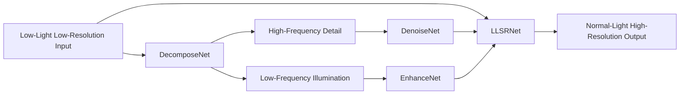

<div align="center">

# DTP: Low-Light Image Super-Resolution

### Official PyTorch implementation of our ICME 2026 paper

[](#)
[](#)
[](#)
[](#)

<p>
Code-only public release of the core DTP framework for low-light image super-resolution.
</p>

<p>
Pretrained weights, datasets, benchmark outputs, and private experimental artifacts are intentionally excluded from this repository.
</p>

<p>
  <a href="#-news">News</a> |
  <a href="#-overview">Overview</a> |
  <a href="#-framework">Framework</a> |
  <a href="#-installation">Installation</a> |
  <a href="#-training">Training</a> |
  <a href="#-inference">Inference</a> |
  <a href="#-citation">Citation</a>
</p>

</div>

---

## :tada: News

- [x] **DTP has been accepted by IEEE ICME 2026.**
- [x] Core training and inference code has been released.
- [x] This repository has been cleaned for public open-source release.
- [ ] Paper link / project page can be added after the public paper release.
- [ ] Pretrained weights are not included in the current public version.

## :sparkles: Overview

DTP is a four-stage low-light image super-resolution framework designed to reconstruct high-quality normal-light high-resolution images from low-light low-resolution inputs.

The model follows a decomposition-driven design:

1. **DecomposeNet** separates the input into high-frequency detail and low-frequency illumination components.
2. **EnhanceNet** enhances the low-frequency illumination branch.
3. **DenoiseNet** suppresses noise in the high-frequency detail branch.
4. **LLSRNet** fuses the original input, denoised detail, and enhanced illumination to reconstruct the final high-resolution output.

## :jigsaw: Framework



## :package: Repository Structure

```text
.
|-- dtp
|   |-- data
|   |   `-- rellisur.py
|   |-- models
|   |   |-- decomposition.py
|   |   |-- enhancement.py
|   |   |-- denoising.py
|   |   |-- sr.py
|   |   `-- pipeline.py
|   |-- utils
|   `-- losses.py
|-- scripts
|   |-- train.py
|   `-- infer.py
|-- requirements.txt
`-- README.md
```

## :pushpin: Release Scope

This repository includes the minimum code required to understand, train, and run the DTP model.

Included:

- model definitions
- loss functions
- dataset loader
- training script
- inference script

Not included:

- pretrained checkpoints
- RELLISUR dataset files
- benchmark outputs and visualization dumps
- baselines and ablation code
- web UI and internal tooling

## :hammer_and_wrench: Installation

```bash
python -m venv .venv
.venv\Scripts\activate
pip install -r requirements.txt
```

Recommended environment:

- Python 3.10+
- PyTorch 2.x
- CUDA-capable GPU for training

CPU inference is supported, but training is expected to run on GPU.

## :open_file_folder: Dataset Preparation

The released training script is written for the **RELLISUR** dataset layout:

```text
RELLISUR/RELLISUR-Dataset/
|-- Train
|   |-- LLLR
|   `-- NLHR
|       |-- X1
|       |-- X2
|       `-- X4
|-- Val
|   |-- LLLR
|   `-- NLHR
|       |-- X1
|       |-- X2
|       `-- X4
`-- Test
    |-- LLLR
    `-- NLHR
        |-- X1
        |-- X2
        `-- X4
```

Naming assumptions in the released loader:

- each low-light filename starts with a five-digit image id
- the ground-truth filename is reconstructed as `<first-five-digits><suffix>`
- `X1` is the normal-light low-resolution supervision
- `X2` or `X4` is the super-resolution target

## :rocket: Training

Example for `x2` super-resolution:

```bash
python scripts/train.py \
  --train-lowlight-dir RELLISUR/RELLISUR-Dataset/Train/LLLR \
  --train-gt-dir RELLISUR/RELLISUR-Dataset/Train/NLHR/X2 \
  --train-low-gt-dir RELLISUR/RELLISUR-Dataset/Train/NLHR/X1 \
  --val-lowlight-dir RELLISUR/RELLISUR-Dataset/Val/LLLR \
  --val-gt-dir RELLISUR/RELLISUR-Dataset/Val/NLHR/X2 \
  --val-low-gt-dir RELLISUR/RELLISUR-Dataset/Val/NLHR/X1 \
  --scale 2 \
  --epochs 200 \
  --batch-size 2 \
  --output-dir checkpoints/dtp_x2
```

Notes:

- validation is optional
- the released training script preserves the original joint optimization strategy
- the decomposition, enhancement, denoising, and SR branches are optimized separately
- checkpoints are saved in a format compatible with the original codebase

Checkpoint keys:

- `La_net`
- `DES_net`
- `decom_net`
- `sr_net`

## :mag: Inference

Single image:

```bash
python scripts/infer.py \
  --checkpoint path/to/checkpoint.pth \
  --input path/to/image.png \
  --output outputs/
```

Folder inference:

```bash
python scripts/infer.py \
  --checkpoint path/to/checkpoint.pth \
  --input path/to/input_folder \
  --output outputs/ \
  --save-branches
```

When `--save-branches` is enabled, the script also exports:

- `high_freq`
- `low_freq`
- `enhanced_low`
- `denoised_high`
- final SR output

## :memo: Open-Source Notes

- This is a **code-only** release.
- Pretrained weights are intentionally not included in the current public version.
- Test-time visual results and benchmark dumps are also excluded.
- `DTPModel.load_checkpoint()` already supports the legacy checkpoint structure if weights are released later.

## :books: Citation

If you find this repository useful, please cite our ICME 2026 paper. The final BibTeX entry can be updated after the official publication metadata becomes available.

```bibtex
@inproceedings{dtp_icme2026,
  title     = {To appear},
  author    = {To appear},
  booktitle = {IEEE International Conference on Multimedia and Expo (ICME)},
  year      = {2026}
}
```

## :mailbox: Contact

For questions regarding the paper or the release, please open an issue in this repository.
