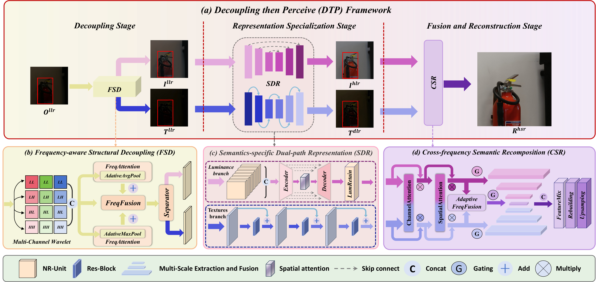

<div align="center">

# Dual-Path Learning based on Frequency Structural Decoupling and Regional-Aware Fusion for Low-Light Image Super-Resolution

---

### Official PyTorch implementation of our ICME 2026 paper

[](#)
[](#)
[](#)
[](#)

Ji-Xuan He<sup>1,*</sup>, Jia-Cheng Zhao<sup>1,*</sup>, Feng-Qi Cui<sup>2,&dagger;</sup>, Jinyang Huang<sup>1,&dagger;</sup>, Yang Liu<sup>3</sup>, Sirui Zhao<sup>2</sup>, Meng Li<sup>1</sup>, Zhi Liu<sup>4</sup>

<sup>1</sup>Hefei University of Technology, Hefei, China;
<sup>2</sup>University of Science and Technology of China, Hefei, China;
<sup>3</sup>Zhejiang University, Hangzhou, China;
<sup>4</sup>The University of Electro-Communications, Tokyo, Japan

<sup>*</sup>Equal contribution. <sup>&dagger;</sup>Corresponding authors.

Code-only public release of the core DTP framework for low-light image super-resolution.

Pretrained weights, datasets, benchmark outputs, and private experimental artifacts are intentionally excluded from this repository.

[ArXiv Paper](#) | [Dataset Page](https://vap.aau.dk/rellisur/) | [Dataset Download](https://doi.org/10.5281/zenodo.5234969)

[News](#news) | [Overview](#overview) | [Framework](#framework) | [Installation](#installation) | [Training](#training) | [Inference](#inference) | [Citation](#citation)

</div>

<a id="news"></a>

## :tada: News

- [x] **DTP has been accepted by IEEE ICME 2026.**
- [x] Core training and inference code has been released.
- [x] This repository has been cleaned for public open-source release.
- [ ] Paper link / project page can be added after the public paper release.
- [ ] Pretrained weights are not included in the current public version.

<a id="overview"></a>

## :sparkles: Overview

DTP is a three-stage low-light image super-resolution framework designed to reconstruct high-quality normal-light high-resolution images from low-light low-resolution inputs.

The model follows a three-stage decomposition-driven design:

1. **FSD** (`Frequency-aware Structural Decoupling`) separates the input into low-frequency luminance and high-frequency texture components.
2. **SDR** (`Semantics-specific Dual-path Representation`) contains two dedicated branches:
   a bio-inspired luminance enhancer and a hierarchical texture denoiser.
3. **CSR** (`Cross-frequency Semantic Recomposition`) fuses the original input, enhanced luminance, and restored texture to reconstruct the final high-resolution output.

<a id="framework"></a>

## :jigsaw: Framework

The original framework figure from the paper is shown below. Click the image to open the PDF version.

<div align="center">
  <a href="assets/framework.pdf">
    
  </a>
</div>

<div align="center">
  <sub>Original paper figure: <a href="assets/framework.pdf">framework.pdf</a></sub>
</div>

Figure source in the LaTeX paper:

- `Sec/method.tex` -> `\includegraphics[width=1.0\textwidth]{Fig/method.pdf}`

## :package: Repository Structure

```text
.
|-- dtp
|   |-- data
|   |   `-- rellisur.py
|   |-- models
|   |   |-- fsd.py
|   |   |-- sdr.py
|   |   |-- csr.py
|   |   `-- pipeline.py
|   |-- utils
|   `-- losses.py
|-- assets
|   |-- framework.png
|   `-- framework.pdf
|-- scripts
|   |-- train.py
|   `-- infer.py
|-- requirements.txt
`-- README.md
```

## :pushpin: Release Scope

This repository includes the minimum code required to understand, train, and run the DTP model.

Included:

- model definitions
- loss functions
- dataset loader
- training script
- inference script

Not included:

- pretrained checkpoints
- RELLISUR dataset files
- benchmark outputs and visualization dumps
- baselines and ablation code
- web UI and internal tooling

<a id="installation"></a>

## :hammer_and_wrench: Installation

```bash
python -m venv .venv
.venv\Scripts\activate
pip install -r requirements.txt
```

Recommended environment:

- Python 3.10+
- PyTorch 2.x
- CUDA-capable GPU for training

CPU inference is supported, but training is expected to run on GPU.

## :open_file_folder: Dataset Preparation

Download the raw training and evaluation datasets:

- [RELLISUR official page](https://vap.aau.dk/rellisur/)
- [RELLISUR direct download (Zenodo)](https://doi.org/10.5281/zenodo.5234969)

RELLISUR dataset:
Andreas Aakerberg, Kamal Nasrollahi, Thomas B. Moeslund.
“RELLISUR: A Real Low-Light Image Super-Resolution Dataset”.
NeurIPS Datasets and Benchmarks 2021.

According to the official dataset page, RELLISUR provides real low-light low-resolution images paired with normal-light high-resolution references. The dataset contains 12,750 paired images across different resolutions and low-light levels, and is designed to bridge low-light enhancement and image super-resolution in a unified benchmark setting.

The released training script is written for the **RELLISUR** dataset layout:

```text
RELLISUR/RELLISUR-Dataset/
|-- Train
|   |-- LLLR
|   `-- NLHR
|       |-- X1
|       |-- X2
|       `-- X4
|-- Val
|   |-- LLLR
|   `-- NLHR
|       |-- X1
|       |-- X2
|       `-- X4
`-- Test
    |-- LLLR
    `-- NLHR
        |-- X1
        |-- X2
        `-- X4
```

Naming assumptions in the released loader:

- each low-light filename starts with a five-digit image id
- the ground-truth filename is reconstructed as `<first-five-digits><suffix>`
- `X1` is the normal-light low-resolution supervision
- `X2` or `X4` is the super-resolution target

<a id="training"></a>

## :rocket: Training

Example for `x2` super-resolution:

```bash
python scripts/train.py \
  --train-lowlight-dir RELLISUR/RELLISUR-Dataset/Train/LLLR \
  --train-gt-dir RELLISUR/RELLISUR-Dataset/Train/NLHR/X2 \
  --train-low-gt-dir RELLISUR/RELLISUR-Dataset/Train/NLHR/X1 \
  --val-lowlight-dir RELLISUR/RELLISUR-Dataset/Val/LLLR \
  --val-gt-dir RELLISUR/RELLISUR-Dataset/Val/NLHR/X2 \
  --val-low-gt-dir RELLISUR/RELLISUR-Dataset/Val/NLHR/X1 \
  --scale 2 \
  --epochs 200 \
  --batch-size 2 \
  --output-dir checkpoints/dtp_x2
```

Notes:

- validation is optional
- the released training script preserves the original joint optimization strategy
- the public code organizes optimization by `FSD`, `SDR-luminance branch`, `SDR-texture branch`, and `CSR`
- checkpoints now follow the paper naming

Checkpoint keys:

- `fsd`
- `sdr`
- `csr`

Legacy checkpoint support:

- the loader still reads the earlier internal format with `La_net`, `DES_net`, `decom_net`, and `sr_net`

<a id="inference"></a>

## :mag: Inference

Single image:

```bash
python scripts/infer.py \
  --checkpoint path/to/checkpoint.pth \
  --input path/to/image.png \
  --output outputs/
```

Folder inference:

```bash
python scripts/infer.py \
  --checkpoint path/to/checkpoint.pth \
  --input path/to/input_folder \
  --output outputs/ \
  --save-branches
```

When `--save-branches` is enabled, the script also exports:

- `luminance_llr`
- `texture_llr`
- `luminance_hlr`
- `texture_dlr`
- final `restored_hsr` output

## :memo: Open-Source Notes

- This is a **code-only** release.
- Pretrained weights are intentionally not included in the current public version.
- Test-time visual results and benchmark dumps are also excluded.
- `DTPModel.load_checkpoint()` already supports the legacy checkpoint structure if weights are released later.

<a id="citation"></a>

## :books: Citation

If you find this repository useful, please cite our ICME 2026 paper. The final BibTeX entry can be updated after the official publication metadata becomes available.

```bibtex
@inproceedings{dtp_icme2026,
  title     = {To appear},
  author    = {To appear},
  booktitle = {IEEE International Conference on Multimedia and Expo (ICME)},
  year      = {2026}
}
```

## :mailbox: Contact

For questions regarding the paper or the release, please open an issue in this repository.
